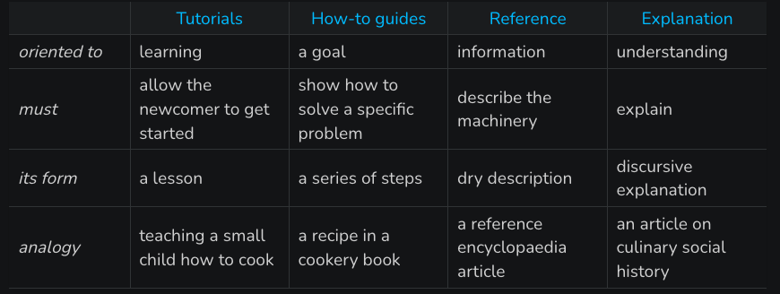

# Documentation, JupyterBook and Github Pages

* A quick overview of: [The Documentation System](https://documentation.divio.com)




* [JupyterBook 101](https://docs.google.com/presentation/d/1D7jZ9mI-VcU9-s9IEEuGCvQH4rm5Bpwc3xek1Mu_Nak/edit#slide=id.g1057b8b45eb_0_2)


* Getting this to work on the hub?

We need to run sphinx manually. These are the key commands for your reference:

```bash
jupyter-book config sphinx .
sphinx-build  . _build/html -D html_baseurl=${JUPYTERHUB_SERVICE_PREFIX}/proxy/absolute/8000
```

Then we can view the code with (in another terminal), going to the `_build/html` folder and running:

```bash
python -m http.server
```

and then heading to this URL:

[https://stat159.datahub.berkeley.edu/user-redirect/proxy/8000/index.html](https://stat159.datahub.berkeley.edu/user-redirect/proxy/8000/index.html)

