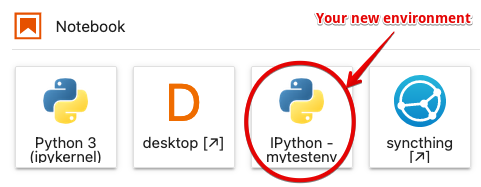

# A quick guide to conda environments on our JupyterHub

In our next lecture we will take a deeper dive into the details of environments for reproducible computation. This is a quick, practical guide to using environments in our JupyterHub installation. For the purposes of this discussion (the term 'environment' has multiple uses), a _conda_ environment is a directory containing a collection of packages you have installed and can use (full documentation is [available here](https://docs.conda.io/projects/conda/en/latest/user-guide/concepts/environments.html)). Environments are accessed by name, and you can switch between environments by _activating_ and _deactivating_ them.

An environment can be built by hand, simply by installing packages into it. But by explicitly declaring in a file the packages that make an environment, the concept becomes key to reproducibility.  That file can then be used to re-create the environment with the same list of packages (and potentially the same versions and even the exact same builds) on a different system.

```{note}
This type of environment is associated with the `conda` tool linked above, but in practice we have two nearly equivalent commands we can use to manage them: `conda` and `mamba`. The latter is a newer implementation of the same ideas that has a number of performance advantages. While we will continue referring to "conda environments," in practice we will use the `mamba` command for some tasks. In particular, we will always use mamba to install packages, as it can be much, _much_ faster than conda. 
```

On our hub, when running notebooks by default they use the kernel and packages associated with the `notebook` environment. When starting a new terminal, you may find yourself in the `base` environment that has no other packages, and may need to switch to the `notebook` environment if you want to access the same packages that you do from the notebook.

For the remaining of the course, you may need for some of your projects to install custom packages, and you will want to do that in a way that makes it possible for others (your teammates, instructors, etc) to have the same packages installed.

## Storing your environments in a persistent location

The first step to create new environments you can access later is to put them in a persistent location. You should create a folder for all your new environments, I recommend using:

```bash
mkdir $HOME/envs
```

so that from now on, all new environments you create will live in `~/envs`. To tell conda that this is where you want to use your environments, create a file named `.condarc` in your home directory (or edit it if it's there already)

```
envs_dirs:
  - ~/envs
  - ~/shared/envs 
```

The second path, `~/shared/envs` is there in case we (the instructors) create new environments for you in addition to the system default one.

```{tip}
You should add, if you don't have it already, `.condarc` to your `.dotfiles` repo!
```

## Creating a new environment in that location

Next, you will define the packages you want to install in your environment by using a file called `environment.yml` such as this one (you can find more details in the [documentation](https://docs.conda.io/projects/conda/en/latest/user-guide/tasks/manage-environments.html#create-env-file-manually)):

```yaml
name: mytestenv
dependencies:
  - python=3.9
  - tqdm=4.62.3
```

This file defines an environment with only Python 3.9 and the `tqdm` package installed in it. Once you have this file, you can create this environment with the command:

```
mamba env create -f environment.yml -p ~/envs/mytestenv
```

After it runs through the installation process, you should be able to see it listed along with the system-wide environments with the command `mamba env list`:

```bash
(base) (main)jupyter-fernando-2eperez[environments]> mamba env list
# conda environments:
#
mytestenv                /home/jovyan/envs/mytestenv
base                  *  /srv/conda
notebook                 /srv/conda/envs/notebook
```

You can now use it by typing  `conda activate mytestenv`, and stop using it with `conda deactivate`.

```{note}
Note that we use `conda` and _not_ `mamba` to activate/deactivate environments.  This may change in the future.
```

## Updating your environment with new packages

While you can then install new packages in the environment at the command line by using `mamba install <package-name>`, you should always record which packages you mean to install in the `environment.yml` file so you can reproduce later the same environment or share it with colleagues.

For your homework projects, the `environment.yml` file should obviously go into the git repository, so that every team member (and your instructors) can also create the environment in the same fashion.

If you have new packages listed in your `environment.yml` file (because you edited it or changes were made to it by a colleague and you got these changes over git, for example), you can apply these updates with this command:

```bash
mamba env update --file environment.yml --prune
```

(the `--prune` option removes packages that may have been deleted from the file, if any, and is not strictly necessary though recommended to keep your environment in sync with the specification in the file).

## Using an environment in your notebooks

So far, our simple `mytestenv` environment can only be used at the command-line, but it will not be available for your notebooks. For that to work, you need to complete two additional steps.

First, you must install in this environment the `ipykernel` package. The following `environment.yml` file would give you a kernel you can use in the Hub (albeit with only the `tqdm` package, obviously):

```{literalinclude} environment.yml
:language: yaml
```

Second, you need to let Jupyter know that you want to use this environment's kernel, by installing the environment's ipykernel into Jupyter:

```
python -m ipykernel install --user --name mytestenv --display-name "IPython - mytestenv"
```

In the above, the `--name` value is used internally by Jupyter and can be anything, while you should make the `--display-name` be descriptive, as that's what is shown in the Launcher icons.

The above command will write a set of files into `~/.local/share/jupyter/kernels/mytestenv` with the information about how to run the kernel, its logo, etc.

After completing these steps, when you click on the launcher in JupyterLab you should see something like the following:



You can now use these same techniques to manage as many environments as you need for your new projects.


## Environments and Makefiles

We've discussed how to automate workflows with Make - once your repos have environments in them, the following Makefile illustrates for example how to create and set up the environment as discussed above via a Makefile:

```{literalinclude} Makefile
```

One of the options presented uses this bash script:

```{literalinclude} envsetup.sh
```